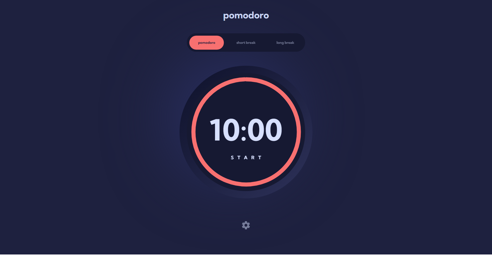

# Frontend Mentor - Pomodoro app solution

This is a solution to the [Pomodoro app challenge on Frontend Mentor](https://www.frontendmentor.io/challenges/pomodoro-app-KBFnycJ6G). Frontend Mentor challenges help you improve your coding skills by building realistic projects. 

## Table of contents

- [Overview](#overview)
  - [The challenge](#the-challenge)
  - [Screenshot](#screenshot)
  - [Links](#links)
- [My process](#my-process)
  - [Built with](#built-with)
  - [What I learned](#what-i-learned)
  - [Continued development](#continued-development)
  - [Useful resources](#useful-resources)
- [Author](#author)
- [Acknowledgments](#acknowledgments)

## Overview

### The challenge

Users should be able to:

- Set a pomodoro timer and short & long break timers
- Customize how long each timer runs for
- See a circular progress bar that updates every minute and represents how far through their timer they are
- Customize the appearance of the app with the ability to set preferences for colors and fonts

### Screenshot

### Links

- Solution URL: https://www.frontendmentor.io/solutions/react-js-sass-javascript-state-variables-into-inline-css-tIjFBRVPm
- Live Site URL: https://chrisp1108.github.io/pomodoro-app/

## My process

Everything seems to work as I planned. There wasn't any information as far as if the clock should count down or count up from 0, nor if the circular progress bar should start full and go backwards or start at nothing and go to full.

I set it up so the clock counts down and the circular progress bar starts at nothing and goes to full once the clock has counted down to 0.

Since the app wasn't a large project, I setup all React state variables in the App.js file and passed them to all the other components via props and didn't need to use redux.

I separated the layout into various components, including options, clock, and settings component.

I used quite a bit of @media queries so that the size of the clock would adjust accordingly to different screen widths.

I utilized a bit of inline CSS styling with Javascript state variables to make the colors, fonts, and circular progress bar change accordingly. I also utilized setInterval to call a function with if/else if statements to evaluate conditions and change the clock accordingly, along with calculating the total number of minutes/seconds remaining by the value remaining on the progress bar to increment the circular progress bar accordingly.

### Built with

- React JS
- SASS CSS Preprocessor
- Flexbox
- Inline CSS Javascript Variable State Integration
- [React](https://reactjs.org/) - JS library

### What I learned

The biggest thing I learned was how to manage state.  I had some challenges getting state to update, especially given that React state is
non mutatable and has to be completely replaced utilizing spread syntax.

## Author

- Website - https://github.com/ChrisP1108
- Frontend Mentor - https://www.frontendmentor.io/profile/ChrisP1108
- LinkedIn - https://www.linkedin.com/in/christopher-paschall/